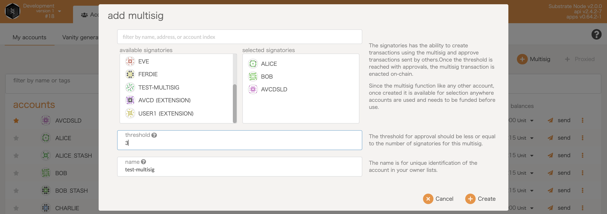
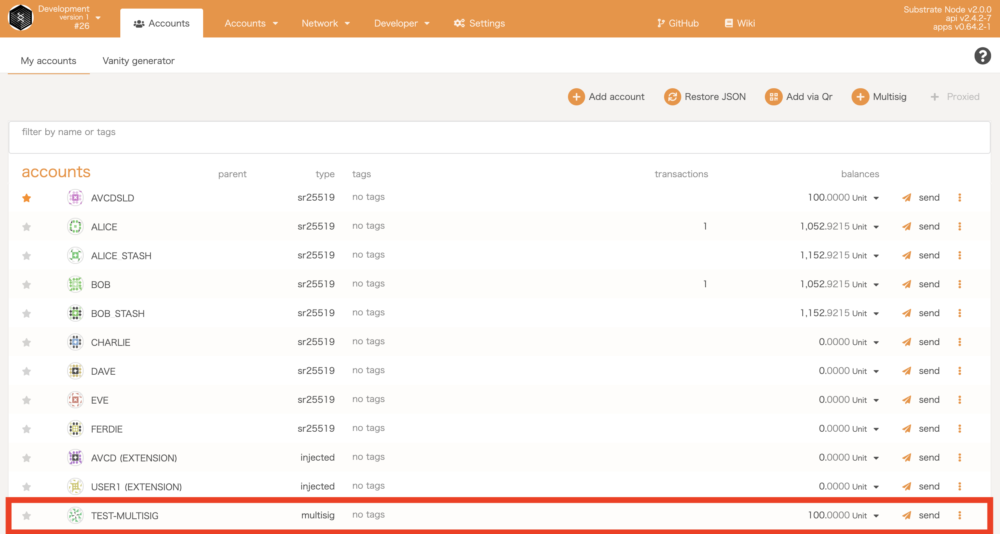
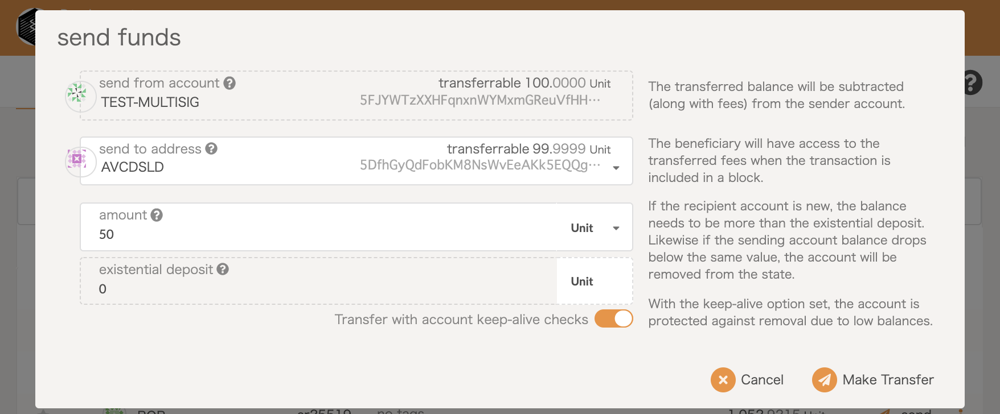
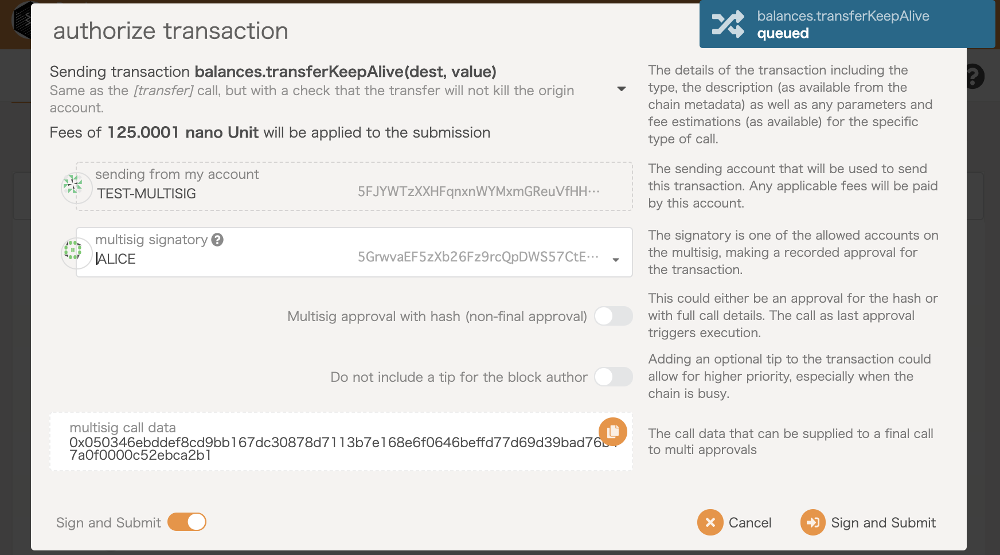
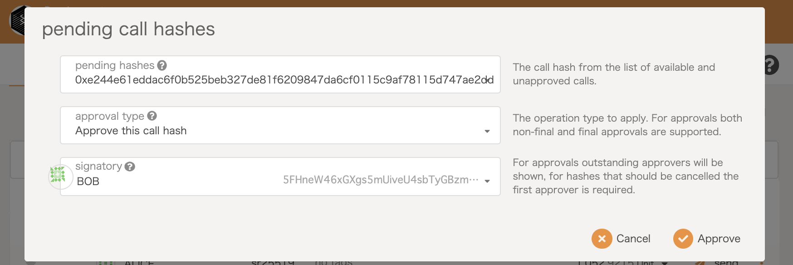
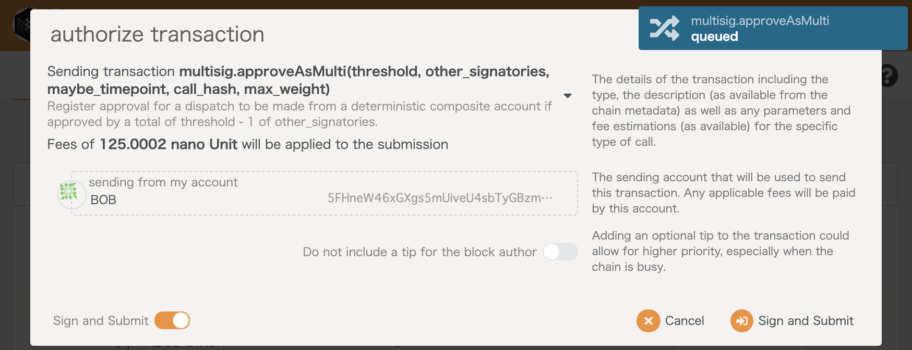
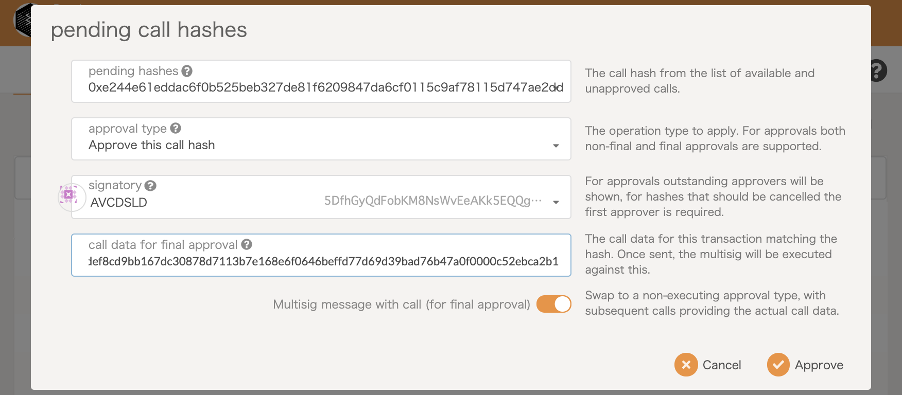
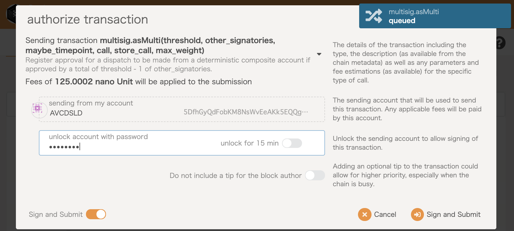
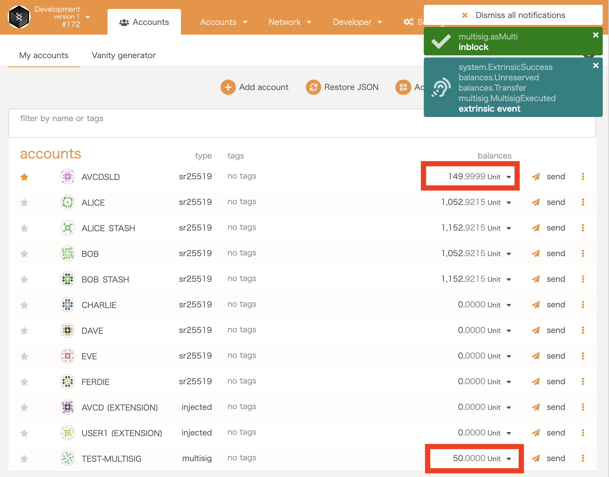
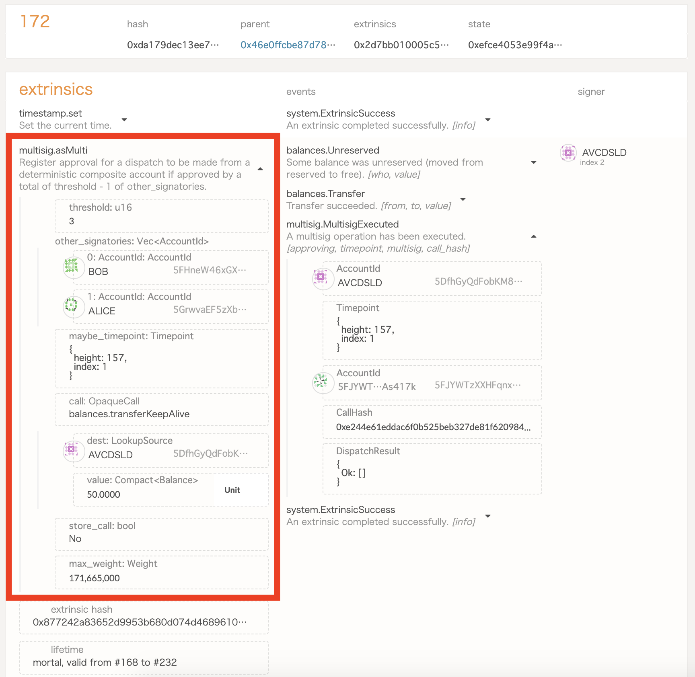

## FRAME Multisig

### Proof that the UI component works
This UI component for multisig is very simple and simply initiates a multisig transfer. The co-signer will then need to send further transactions.

### Proof that the embedded Multisig pallet works

Create multisig wallet

Deposit to the multisig wallet

Create multigis transfer

Alice signs

Bob signs

My account (`Avcdsld`) signs

Multisig transfer is succeeded

Event

